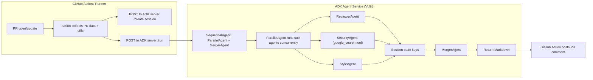

# Sentinel Action – Agentic-Powered PR Review GitHub Action

Sentinel Action is a GitHub Action that automatically reviews pull requests using a backend AI agent system.  
It analyzes code diffs for **security issues, vulnerabilities, and general engineering concerns**, and posts a structured review back to the pull request.

The action itself runs entirely inside GitHub Actions.  
The AI logic is handled by a **remote backend service** (deployed on Vultr) that supports **parallel specialized agents**.


## How It Works

1. The GitHub Action runs on pull request events.
2. It collects the PR metadata and code diffs.
3. The diffs are sent to a remote AI agent service.
4. Multiple specialized agents analyze the code in parallel.
5. A merged review is generated and posted back to the pull request.

### High-level flow



## Repository Structure

```
.
├─ action.yml              # GitHub Action definition
├─ index.js                # Action source code
├─ dist/
│  └─ index.js             # Bundled action (used by GitHub)
├─ package.json
├─ package-lock.json
├─ README.md
│
├─ backend/                # AI agent backend (reference implementation)
│  ├─ agent.py
│  ├─ Dockerfile
│  ├─ docker-compose.yml
│  └─ requirements.txt
│
└─ .github/
   └─ workflows/
      └─ pr-review.yml
```

Note: The `backend/` folder is not executed by the GitHub Action.

It exists for reference, transparency, and local deployment.


## Requirements

To use this action, you need:

- A GitHub repository with pull requests enabled
- Permission to add GitHub Actions workflows


## Backend Service

The action communicates with an external backend service over HTTP.

The backend is responsible for:
- Accepting pull request diffs
- Running parallel AI agents (security, quality, style etc.)
- Returning a structured review in JSON format
- More details can be found here - [README.md](agentic-backend/README.md)

## Usage

Create a workflow file:

```
.github/workflows/pr-review.yml
```

Example workflow:

```yaml
name: Sentinel PR Review

on:
  pull_request:
    types: [opened, synchronize, reopened]

permissions:
  contents: read
  pull-requests: write

jobs:
  review:
    runs-on: ubuntu-latest
    steps:
      - uses: actions/checkout@v4

      - name: Run Sentinel AI Review
        uses: kautilyadevaraj/sentinel-action@v1
```

No additional configuration is required.


## Permissions

The workflow must include:

```yaml
permissions:
  contents: read
  pull-requests: write
```

This allows the action to:
- Read pull request diffs
- Post comments on pull requests


# Security Notes

- Secrets are stored using GitHub Secrets
- Backend URL and token are never logged
- No credentials are committed to the repository
- Backend source code can be audited in the `backend/` directory

## License

[MIT License](LICENSE.md)