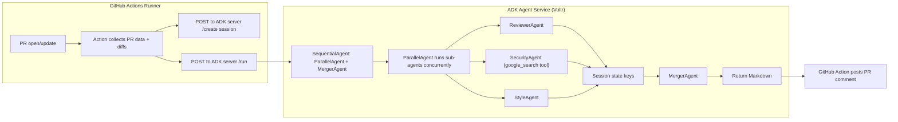
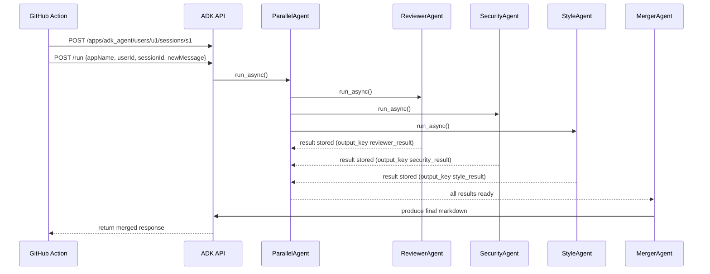
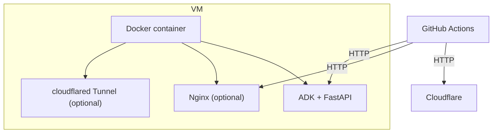

# Backend (Vultr) — Sentinel AI Agent Service

> This document describes how to run the Sentinel AI agent backend (ADK-based) on a Vultr or similar Ubuntu VM.  
> It includes a complete setup guide, configuration, deployment options, troubleshooting, and architecture diagrams. Follow these steps exactly for predictable results.


## Table of Contents

1. Overview
2. Architecture
3. Requirements
4. Directory layout 
5. Preparing the Vultr VM
   - Create instance
   - SSH key setup
   - Basic hardening & firewall
6. Installing Docker & Docker Compose
7. Deployment options
   - Docker Compose 
   - Systemd + Gunicorn / Uvicorn (alternative)
8. Environment configuration (`.env`)
9. Building and running (Docker)
10. Verifying the service
11. Testing with `curl`
12. Integrating with GitHub Actions
13. Logs, monitoring, and restarting
14. Updating the service
15. Troubleshooting guide
16. Security considerations
17. FAQ
18. Credits & references


## 1. Overview

This backend hosts the ADK (Agent Development Kit) FastAPI server that runs multiple AI agents (ParallelAgent + sub-agents + merger). The GitHub Action posts PR diffs to this service, which responds with a merged Markdown review.

Key endpoints:

- `GET /list-apps` — list discovered ADK apps
- `POST /apps/{app}/users/{user}/sessions/{session}` — create a session
- `POST /run` — run the agent pipeline (primary endpoint)
- `POST /run_sse` — optional streaming endpoint

The ADK server discovers agent folders (each with a `root_agent`) and exposes them via the API server.


## 2. Architecture

Below are diagrams showing how the system behaves. The diagrams use [Mermaid](https://mermaid-js.github.io/) syntax so they render in supported viewers (GitHub renders mermaid in markdown).

### 2.1 High-level flow



### 2.2 Parallel Agent detail



### 2.3 Deployment components




## 3. Requirements

- A Vultr (or other) Linux VM — Ubuntu 22.04/24.04 recommended
- 1 vCPU, 2GB RAM minimum (4GB recommended for models and tools)
- Docker installed (or ability to install)
- If using Google tools (ADK + google_search), network access (outbound) and API credentials as required
- A domain (optional, for Cloudflare Tunnel)
- Ability to open firewall ports (8000 etc.)


## 4. Directory layout (recommended)

On the VM, clone the repo at `/opt/sentinel-backend` (example):

```
/opt/sentinel-backend
├─ agents/                   # ADK agents   
directory (root passed to adk api_server)
│  ├─ adk_agent/
│  │  ├─ __init__.py
│  │  └─ agent.py
│  └─ other_agent/
├─ Dockerfile
├─ docker-compose.yml
├─ .env
└─ README.md
```


## 5. Preparing the Vultr VM

### 5.1 Create instance

- Pick Ubuntu 24.04 LTS x64 (or 22.04).
- 1 vCPU / 2GB RAM minimum (2 vCPU/4GB preferred).
- Attach an SSH key during creation (recommended).

### 5.2 SSH key setup

If you didn’t attach a key during creation, generate one on your machine:

```bash
ssh-keygen -t ed25519 -C "vultr-adk"
cat ~/.ssh/id_ed25519.pub
```

Add the public key in the Vultr console (or use the provided root password once).

### 5.3 Initial login & basic hardening

SSH in:

```bash
ssh root@<VULTR_IP>
```

Update packages:

```bash
apt update && apt upgrade -y
```

Create a non-root user (recommended):

```bash
adduser sentinel
usermod -aG sudo sentinel
```

Set up UFW (basic firewall):

```bash
ufw allow OpenSSH
ufw allow 8000/tcp        # ADK default port if needed
ufw enable
```


## 6. Installing Docker & Docker Compose

If you plan to use Docker Compose:

```bash
# install docker
apt update
apt install -y docker.io

# enable and start docker
systemctl enable --now docker

# install docker compose plugin (Ubuntu 24.04)
apt install -y docker-compose-plugin
# verify
docker compose version
```

If `docker compose` package not found, install legacy docker-compose:

```bash
curl -L "https://github.com/docker/compose/releases/latest/download/docker-compose-linux-x86_64" -o /usr/local/bin/docker-compose
chmod +x /usr/local/bin/docker-compose
docker-compose version
```


## 7. Deployment options

### 7.1 Docker Compose (recommended)
Create `docker-compose.yml` at repo root with (example):

```yaml
version: "3.8"
services:
  adk:
    build: .
    image: sentinel-adk:latest
    ports:
      - "8000:80"   # map container port (see Dockerfile)
    env_file:
      - .env
    volumes:
      - ./agents:/app/agents:ro
    restart: unless-stopped
```

Dockerfile example (simple):

```dockerfile
FROM python:3.11-slim

WORKDIR /app

RUN apt-get update && apt-get install -y build-essential

COPY requirements.txt .
RUN pip install --no-cache-dir -r requirements.txt

COPY . /app

EXPOSE 80

CMD ["adk", "api_server", "--host", "0.0.0.0", "--port", "80", "./agents"]
```

Build & run:

```bash
docker compose build
docker compose up -d
```

Notes:
- Using `./agents` as agents root.
- ADK CLI `adk api_server` listens on the container port.

### 7.2 Systemd + Gunicorn/Uvicorn (alternative)
You can run `adk api_server` directly inside a venv and use systemd to manage it. See instructions later in this doc if you prefer no Docker.


## 8. Environment configuration (`.env`)

Create `.env` in repo root (never commit). Example:

```
GOOGLE_API_KEY=your_gemini_api_key_here
AGENT_AUTH_TOKEN=pick-a-strong-secret-32chars
```

If you use Google ADK with Vertex/Studio, set credentials accordingly and mount the JSON into the container (`-v /path/creds.json:/app/secrets/gcloud.json:ro`).


## 9. Building and running (Docker)

From `/opt/sentinel-backend`:

```bash
docker compose build
docker compose up -d
```

Check containers:

```bash
docker compose ps
docker compose logs -f
```

Ensure the ADK API is reachable internally:

```bash
curl http://127.0.0.1:8000/list-apps
```

If you used port mapping `8000:80` then externally use `http://<VULTR_IP>:8000/list-apps`.


## 10. Verifying the service

1. List agents:
```bash
curl http://<VULTR_IP>:8000/list-apps
```
Expected: `["adk_agent"]` or other agents you've configured.

2. Create a session:
```bash
curl -X POST http://<VULTR_IP>:8000/apps/adk_agent/users/test/sessions/s1 -H "Content-Type: application/json" -d '{}'
```

3. Call the pipeline:
```bash
curl -X POST http://<VULTR_IP>:8000/run -H "Content-Type: application/json" -d '{
  "appName":"adk_agent",
  "userId":"test",
  "sessionId":"s1",
  "newMessage": { "role":"user","parts":[{"text":"Hello"}] }
}'
```

Check response — you should receive an events array; the final assistant event contains the agent's text.


## 11. Testing with `curl` (example PR run)

Use this single-step payload but ensure diffs are inside `text` (ADK validation forbids extra unknown fields):

```bash
curl -X POST http://<VULTR_IP>:8000/apps/adk_agent/users/ci/sessions/pr-123 -H "Content-Type: application/json" -d '{}'

curl -X POST http://<VULTR_IP>:8000/run -H "Content-Type: application/json" -d '{
  "appName":"adk_agent",
  "userId":"ci",
  "sessionId":"pr-123",
  "newMessage": {
    "role":"user",
    "parts": [
      { "text": "Review PR #123:

--- src/server.js ---
+ const express = require('express');
+ const app = express();
- app.listen(3000);"}
    ]
  }
}'
```


## 12. Integrating with GitHub Actions

Your action (client) must:

1. Create session:
```
POST /apps/{app}/users/{user}/sessions/{session}
```

2. Call `/run` with the body:
```json
{
  "appName":"adk_agent",
  "userId":"github-action",
  "sessionId":"pr-<number>",
  "newMessage":{
    "role":"user",
    "parts":[{"text":"<DIFFS_AS_TEXT>"}]
  }
}
```

3. Parse ADK response and extract assistant content (final markdown) and post as PR comment via GitHub API.

See `index.js` in the root repository for an implementation.


## 13. Optional: Cloudflare Tunnel (hide origin IP)

If you do not want to expose the Vultr IP, use Cloudflare Tunnel:

1. Install `cloudflared` on VM.
2. `cloudflared login` (opens browser to authenticate to Cloudflare account).
3. `cloudflared tunnel create adk-tunnel`
4. Create `/root/.cloudflared/config.yml`:

```yaml
tunnel: <TUNNEL_ID>
credentials-file: /root/.cloudflared/<TUNNEL_ID>.json

ingress:
  - hostname: adk.yourdomain.com
    service: http://localhost:8000
  - service: http_status:404
```

5. Run as service:
```bash
cloudflared service install
systemctl enable --now cloudflared
```

Your ADK server will be reachable at `https://adk.yourdomain.com` and origin IP will not be public.


## 14. Logs, monitoring, and restarting

- Docker logs:
```bash
docker compose logs -f
```

- Container restart policy: `restart: unless-stopped` in `docker-compose.yml`.

- Systemd (if using direct venv run):
```bash
sudo journalctl -u adk_agent -f
sudo systemctl restart adk_agent
```


## 15. Updating the service

If you change agent code:

```bash
git pull
docker compose build
docker compose up -d
```

If you mount `./agents` as a volume, changes to agent files may be picked up by ADK api_server without rebuilding — but restarting container is recommended for deterministic behavior.


## 16. Troubleshooting

### 422 / validation errors
ADK expects `parts[]` objects with known fields (`text`, etc.). Avoid unknown fields like `diffs` directly — inline diffs into the `text` field.

### 404 Not Found when calling `/run`
- Check the server base URL and port
- Ensure `adk api_server` is listening on the configured path
- Use `curl http://127.0.0.1:8000/list-apps` locally on VM to verify

### "Session not found"
Create a session first:
```
POST /apps/{app}/users/{user}/sessions/{session}
```

### Module errors in Docker
- Rebuild the image
- Verify `requirements.txt` installs correct versions
- Check for missing environment variables in `.env`


## 17. Security considerations

- Never commit `.env` or credential files.
- Use Cloudflare Tunnel or proper firewall rules to avoid exposing VM IP.
- Protect the public endpoint with a header token (e.g., `x-agent-auth`) or API key.
- Rotate keys regularly.
- Monitor usage — parallel agents can consume API/model tokens quickly.


## 18. FAQ

**Q: Can I run multiple agent apps?**  
A: Yes — ADK discovers each agent folder with a `root_agent` value. Use `./agents` containing subfolders.

**Q: Does ParallelAgent share state automatically?**  
A: No. Use session keys or external storage to share state explicitly. Merger runs after parallel branches complete.

**Q: How do I reduce token usage?**  
A: Shorten prompts, reduce sub-agent complexity, cache results, or lower model choice.


## 19. Credits & references

- ADK documentation: https://google.github.io/adk-docs/
- Vultr docs: https://docs.vultr.com/
- Cloudflare Tunnel docs: https://developers.cloudflare.com/cloudflare-one/connections/connect-apps/


## Appendix: Useful commands summary

```bash
# Clone and run
cd /opt
git clone https://github.com/your-username/your-repo.git
cd your-repo

# Create .env from template and edit
cp .env.template .env
nano .env

# Build and run with Docker Compose
docker compose build
docker compose up -d

# Verify locally
curl http://127.0.0.1:8000/list-apps
curl -X POST http://127.0.0.1:8000/apps/adk_agent/users/test/sessions/test -H "Content-Type: application/json" -d '{}'

# Troubleshoot logs
docker compose logs -f
```

---
